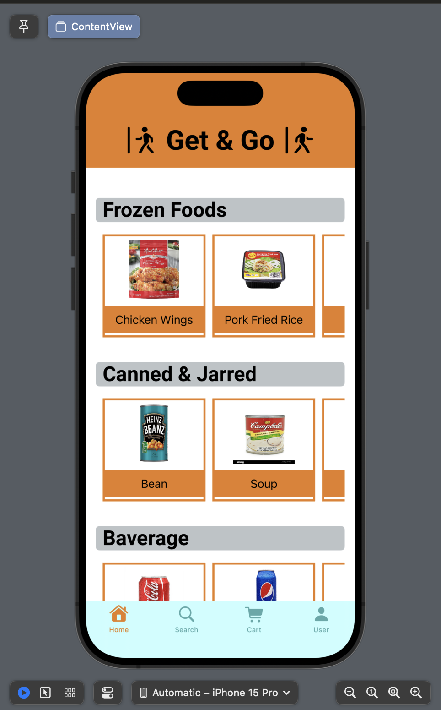
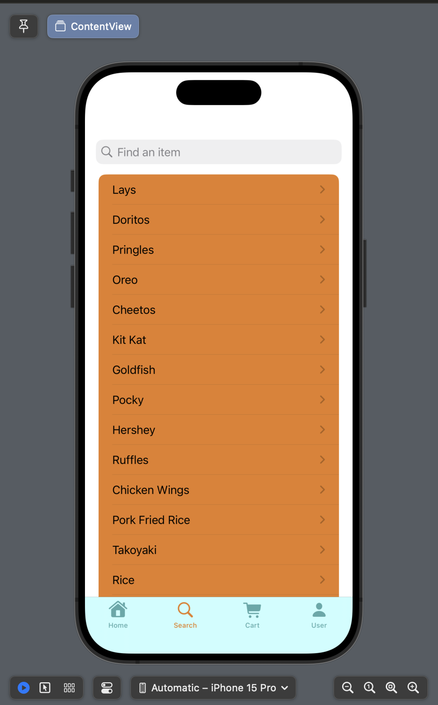
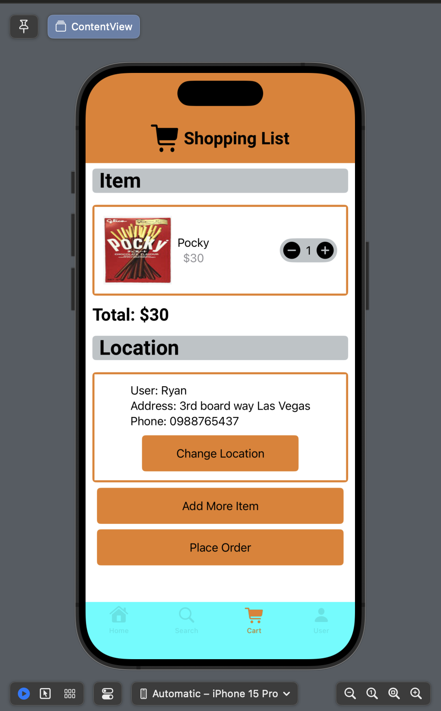
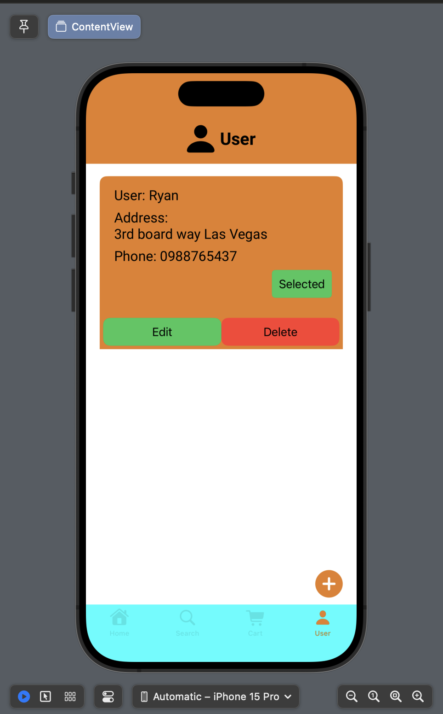
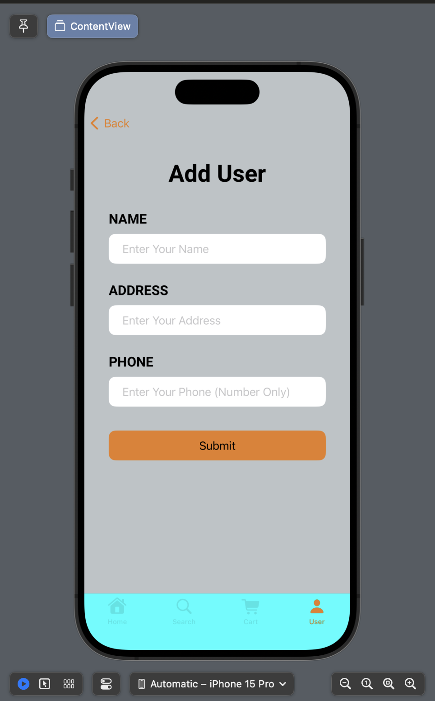
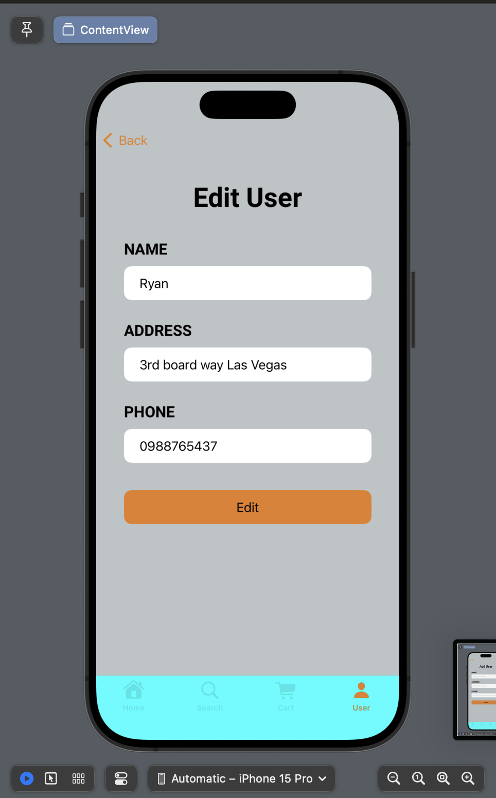

# E-Commerce-SwiftUI

## Introduction

&nbsp;&nbsp;&nbsp;&nbsp;I create a mobile e-commerce platform's front-end application. The program consists of displaying and searching every object within the program. The user has the option to select the desired item. Every item that has been chosen will be kept in the basket and be able to be shipped. Additionally, the application allows you to add users and change user data. It also supports multiple users.

## Application's Page

### Home Page

&nbsp;&nbsp;&nbsp;&nbsp;The home page displays all the item in the database for the user to select.

### Search Page

&nbsp;&nbsp;&nbsp;&nbsp;The search page allow the user to find the specific item that they wanted.

### Cart Page

&nbsp;&nbsp;&nbsp;&nbsp;The cart page allow the user to see all the item they selected, how much money the user have to pay, and select the location the user want all the item to send. The system will also make sure that there is/are item(s) in the cart, and location send to

### User Page

&nbsp;&nbsp;&nbsp;&nbsp;The user page display all the location where the user want the item to be send. The user also able to delete or edit the existed location, and add new location.

### Add Page

&nbsp;&nbsp;&nbsp;&nbsp;The add page show user a form with all the neccesarly information to create a new location

### Edit Page

&nbsp;&nbsp;&nbsp;&nbsp;The edit page show user a pre-filled form with the data of the section that the user selected. The user will be able to edit all the data in that form

